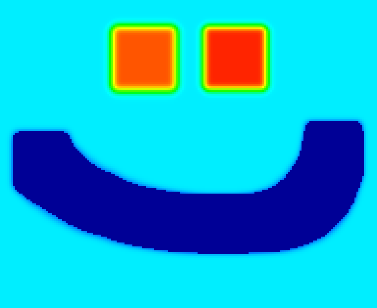

  # Dino: Thermodynamic Cellular Automata Engine
  

  

**Dino** is a high-performance, custom-built physics simulation engine based on cellular automata. Written in **C++** using the **Raylib** framework, it goes beyond standard "falling sand" games by implementing a robust **thermodynamics system** that simulates heat diffusion, phase changes, thermal inertia, and state-of-matter interactions in real-time.

 Download & Play
You don't need to compile the code to try it out! You can download the latest playable version (Windows .exe) directly from Itch.io:

[Dino on Itch.io](https://bhdriyol.itch.io/dino)

##  Documentation & Wiki

Explore the comprehensive documentation to understand the physics behind the engine or learn how to play.

 **[Click here to open the Official Wiki](../../wiki)**

### Quick Links
*  **[User Guide](../../wiki/User-Guide)** – Controls, Tools, and how to play.
*  **[Thermodynamics System](../../wiki/Thermodynamics-System)** – Deep dive into the heat diffusion & physics logic.
*  **[Elements Reference](../../wiki/Elements-Reference)** – Full list of materials, melting points, and reactions.
*  **[Developer Guide](../../wiki/Developer-Guide)** – How to contribute and add new elements to the code.

##  Key Features

### 1\. Thermodynamics System

Unlike simple particle toys, every cell in this simulation possesses a temperature value.

  * **Heat Diffusion:** Implements a stable diffusion algorithm that prevents numerical explosions while allowing realistic heat propagation.
  * **Convection & Conduction:** Simulates different heat transfer rates based on the state of matter (e.g., heat rises rapidly in gases but transfers slowly through solids).
  * **Thermal Inertia:** Materials have specific heat capacities. Heating a stone wall takes significantly longer than heating air, adding a layer of realism.
  * **Blackbody Radiation (Glow):** As solid materials heat up (e.g., \>500°C), they begin to incandesce, glowing from red to bright yellow/white based on temperature.

### 2\. Phase Changes

Elements react dynamically to temperature shifts:

  * **Melting:** Sand turns into Molten Glass at 1700°C.
  * **Freezing:** Water turns into Ice below 0°C.
  * **Evaporation:** Water flashes into Steam at 100°C.
  * **Combustion:** Flammable materials (Wood) catch fire and turn into Smoke.

### 3\. Thermal Visualization

Includes a dedicated **Thermal Vision Mode** utilizing a "Jet/Rainbow" color palette interpolation. This allows users to visualize heat gradients, insulation efficiency, and cold pockets in real-time.

### 4\. Tools

Features specialized **HEAT** and **COOL** tools designed for precision experiments:

  * **Material-Aware Interaction:** The tools automatically ignore empty space (Air), allowing users to heat specific objects without creating chaotic hot air pockets.
  * **Thermal Resistance Logic:** The rate of temperature change depends on the material's state (Gases heat instantly, Solids heat gradually).

##  Technical Implementation Details

### The Physics Loop

The simulation runs at a stable 60 FPS. The update loop is divided into distinct phases to ensure stability:

1.  **Thermodynamics Phase:** Calculates heat transfer between neighbors using a differential heat equation adapted for grid-based logic. It handles conductivity variances (Gas-to-Gas vs. Solid-to-Solid).
2.  **Phase Change Logic:** Checks if current temperatures exceed material thresholds (Melting/Freezing points).
3.  **Particle Physics Phase:** Handles gravity, density checks (sand sinking in water), and gas dispersion.

##  Controls

| Key / Action | Function |
| :--- | :--- |
| **Left Click** | Draw Element / Use Tool |
| **Mouse Wheel** | Increase/Decrease Brush Size |
| **T** | Toggle **Thermal Vision Mode** |
| **R** | Reset Simulation |
| **D** | Toggle Debug Overlay |
| **UI Buttons** | Select Elements (Sand, Water, Fire, Wall, Heat Tool, Cool Tool) |

##  Installation & Build

### Prerequisites

  * C++ Compiler (MSVC recommended for Windows)
  * [Raylib](https://www.raylib.com/) Library

### Steps

1.  Clone the repository.
2.  Open the solution file in **Visual Studio 2022** (or your preferred IDE).
3.  Ensure Raylib includes and library paths are correctly linked in project settings.
4.  Build in **Release** mode for optimal performance.
5.  Run the executable (ensure `raylib.dll` is in the same directory if using dynamic linking).

##  Future Roadmap

  * [ ] More elements and reactions.
  * [ ] Pressure system for liquids and gases.
  * [ ] Electricity conduction system.
  * [ ] Save/Load feature for simulation states.
  * [ ] Multi-threaded rendering for larger grid sizes.

##  License

This project is open-source. Feel free to use it for educational purposes or fork it to create your own elements\!

-----

*Developed by [Bahadır İyol] with C++ and Raylib.*
